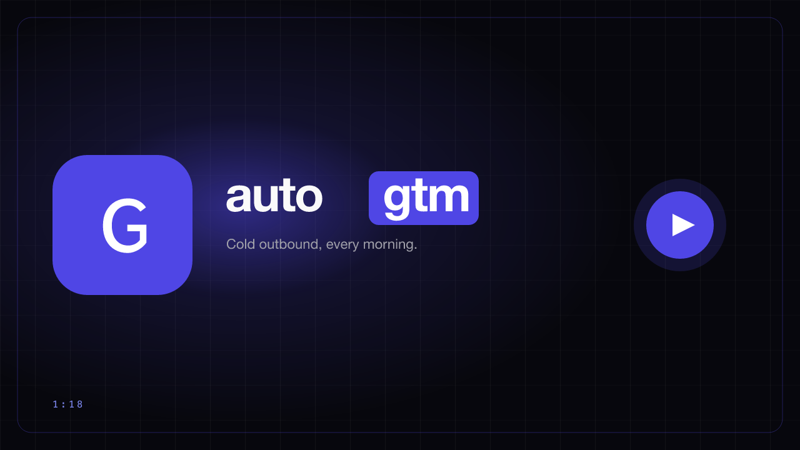

# autogtm

An open-source GTM engine for cold outbound. You describe the buyer in plain English. autogtm searches, scores the leads, writes a sequence, and sends it through Instantly. With Autopilot on, the 10:00 AM ET sweep sends the top leads on its own.

[](https://zthpkrurmodfjyzoqmuc.supabase.co/storage/v1/object/public/social-images/demo-video/autogtm-explainer.mp4)

Click the poster to play. 1:18, recorded on a live account.

## How a lead gets sent

1. Fill in a Company Profile so search has a company to work from. Add a Lead Brief when you want a specific kind of person ("acting coaches on TikTok with 10k+ followers"). Queue the brief for the morning run, or choose Run now.
2. At 8:30 AM ET, queued briefs become search queries. At 9:00 AM ET, Exa runs them and returns people.
3. Each lead gets a bio, social links, audience size, expertise tags, and a 1–10 fit score with a written reason.
4. Each lead also gets a draft multi-step sequence. You click Create and Start Campaign, or you leave it for Autopilot.
5. At 10:00 AM ET, with Autopilot on, the top N Ready-to-Add leads above your fit-score floor are added to their campaigns. A digest lists what was added and to which campaign.
6. Instantly status and analytics sync every hour. At 2:00 PM ET a second digest covers leads found, emails sent, opens, and replies.

When no new briefs are waiting, exploration mode writes its own queries so the next morning still has searches to run.

Fresh-copy Autopilot can rewrite a draft against the lead's bio right before the send, so a sequence written earlier does not go out stale.

System off stops search, enrichment, campaigns, and Autopilot. Each company has its own switch, and one dashboard can hold several companies.

## Schedule

Times are America/New_York.

| When | What runs |
| --- | --- |
| 8:30 AM | Queued briefs become search queries |
| 9:00 AM | Exa search, then enrichment |
| 10:00 AM | Autopilot sweep and its digest |
| Hourly | Instantly status and analytics |
| 2:00 PM | Discovery digest |

## Run it

Accounts: [Supabase](https://supabase.com), [Exa](https://exa.ai), [Instantly](https://instantly.ai), [OpenAI](https://platform.openai.com), and [Inngest](https://inngest.com). [Resend](https://resend.com) is only for the digests. Node.js 18 or newer.

```bash
git clone https://github.com/cmn-labs/autogtm.git
cd autogtm
npm install
cp apps/autogtm/.env.example apps/autogtm/.env.local
npm run dev
```

The app is at [http://localhost:3200](http://localhost:3200). In a second terminal:

```bash
npx inngest-cli@latest dev
```

In the Supabase SQL editor, run [schema.sql](./schema.sql). That creates the tables, indexes, RLS policies, and helper functions. On an existing project, apply [migrations/](./migrations/) instead. Those files are safe to re-run.

## Stack

| | |
| --- | --- |
| App | [Next.js 15](https://nextjs.org) (App Router), React 19, [Tailwind CSS](https://tailwindcss.com), [Radix UI](https://radix-ui.com) |
| Data and auth | [Supabase](https://supabase.com) |
| Jobs | [Inngest](https://inngest.com) |
| Search | [Exa](https://exa.ai) Websets |
| Sending | [Instantly](https://instantly.ai) |
| Models | [OpenAI](https://openai.com) (GPT-4.1 / GPT-5-mini) |
| Digests | [Resend](https://resend.com) |

## Deploy

Any Next.js host works. On Vercel, set the environment variables, point Inngest at `/api/inngest`, and use a paid Supabase plan if you need the higher limits.

## License

[AGPL-3.0](LICENSE). You can use it, change it, and ship it. If you run a modified version as a service, that version's source has to be available to its users.
